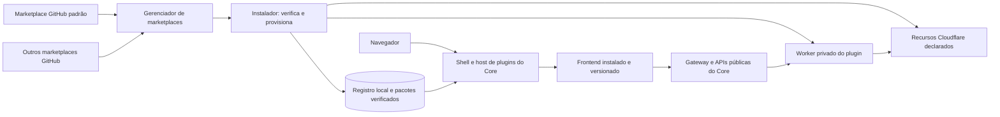

# Plano de plugins independentes e marketplaces GitHub

Status: aprovado e implementado na branch `feat/plugin-marketplace-v2`, com marketplace/SDK publicados e instalação externa comprovada em um ambiente Cloudflare isolado. A prova integral do plugin multirrecurso continua limitada pela cota de Cron da conta Free, e a aceitação com uma segunda fonte GitHub ainda não foi executada.

Atualizado em 9 de setembro de 2026. Base inicial inspecionada: commit `0306de3`, com Core `1.1.0-beta.8`. A implementação e as evidências desta revisão estão registradas na seção 20; a produção permaneceu inalterada.

## 1. Resultado esperado

Preparar o Nexus Edge para receber aplicações completas como plugins: telas, APIs, dados, tarefas e recursos Cloudflare. Depois da transição, um desenvolvedor deverá conseguir criar um plugin em outro repositório, publicá-lo em um marketplace GitHub e instalá-lo em um Nexus existente sem alterar, recompilar ou republicar o código do Core.

O administrador terá uma tela de plugins com instalados, catálogo e gerenciamento de marketplaces. A instalação padrão virá com o marketplace da empresa, mas permitirá removê-lo e cadastrar outros repositórios. Instalar e atualizar ocorrerá pelo painel, com download automático do pacote. Atualizações de plugins e do Core continuarão sendo decisões do administrador.

O principal critério de aprovação técnica será uma demonstração com o Core congelado: construir e instalar um plugin que não existia quando aquela versão do Core foi publicada, depois instalar outro e atualizar ambos, mantendo os hashes dos módulos e assets do Core.

### 1.1 O significado de “não mexer no Core”

| Situação                                              | Comportamento exigido                                                                                 |
| ----------------------------------------------------- | ----------------------------------------------------------------------------------------------------- |
| Criar um novo plugin dentro do contrato suportado     | Nenhuma alteração no código, build, rotas estáticas, traduções ou CI do Core                          |
| Instalar ou atualizar o plugin                        | Publicação do Worker e dos assets do próprio plugin; registros e recursos gerenciados pelo instalador |
| Adicionar um marketplace                              | Alteração de configuração no banco da instalação                                                      |
| Adicionar um binding de plugin                        | Ajuste automático de configuração na Cloudflare, com preservação dos demais bindings                  |
| Atualizar o Core                                      | Operação independente, com verificação de compatibilidade e preservação dos plugins                   |
| Usar uma capacidade de plataforma ainda não suportada | Evolução explícita do contrato/plataforma; nunca uma exceção codificada para um plugin específico     |

A Cloudflare pode registrar uma nova revisão de configuração/deployment quando um Service Binding muda. Isso não significa reconstruir o código do Core. O compromisso é estabilidade do código e dos assets do Core durante operações comuns de plugins, e não imutabilidade de todo o estado operacional da Cloudflare.

“Qualquer plugin futuro” significa qualquer plugin compatível com os contratos publicados. Nenhuma plataforma consegue antecipar todos os novos produtos Cloudflare ou toda forma futura de extensão; a primeira versão deverá cobrir integralmente os recursos prioritários da seção 9.

### 1.2 Premissas para revisão

- Usar D1 como padrão desta instalação, preservando o suporte existente a PostgreSQL nos ambientes que já o utilizam.
- Nome confirmado do marketplace padrão: **Techify**.
- Repositório confirmado e publicado: `Techify-one/nexus-edge-plugins`.
- Entrega inicial proposta para repositórios públicos; suporte privado fica descrito como uma extensão delimitada na seção 8.7, sujeito à preferência do proprietário.
- Manter upload/download de ZIP como alternativas de desenvolvimento, recuperação e transporte. O fluxo principal passa a ser o marketplace.
- A execução local, a publicação no GitHub e um ambiente Cloudflare isolado foram autorizados pelo proprietário. Produção continua sujeita ao fluxo de `main` definido no runbook.

## 2. Diagnóstico do sistema atual

O backend já tem uma base reaproveitável: Worker privado por plugin, gateway genérico, migrações aditivas, permissões, instalação em etapas e preservação de bindings no deploy do Core. O desacoplamento exige ampliar esse mecanismo e retirar os registros de plugins do build central.

| Área atual                                               | Evidência local                                                                                               | Mudança planejada                                                                      |
| -------------------------------------------------------- | ------------------------------------------------------------------------------------------------------------- | -------------------------------------------------------------------------------------- |
| Frontend incorporado à SPA                               | [Guia atual](./PLUGIN-DEVELOPMENT.md) e [router](../frontend/src/main.tsx)                                    | Carregar frontend instalado em tempo de execução                                       |
| Menus permitidos por lista fixa (legado removido)        | [manifest.ts](../workers/core/src/installer/manifest.ts)                                                      | Validar rotas pelo contrato e namespace do plugin                                      |
| ZIP contém somente manifesto, Worker e SQL               | [package-plugin.ts](../scripts/package-plugin.ts)                                                             | Novo pacote com UI, módulos, recursos e metadados verificáveis                         |
| Traduções e rótulos de permissões compostos no Core      | [i18n](../frontend/src/i18n/index.tsx), [permissions.ts](../frontend/src/lib/permissions.ts)                  | Catálogos e rótulos declarados pelo plugin                                             |
| Segredos autorizados por nome de plugin                  | `allowedRuntimeSecrets` em [installer.ts](../workers/core/src/routes/installer.ts)                            | Declarações de segredos e permissões no manifesto                                      |
| Recursos limitados a AI/R2                               | [Manifesto](../workers/core/src/installer/manifest.ts), [upload](../workers/core/src/installer/cloudflare.ts) | Adaptadores genéricos de recursos                                                      |
| Inventário de recursos aceita apenas R2/STORAGE          | [Migração 0008](../workers/core/migrations/d1/0008_plugin_runtime_resources.sql)                              | Novo inventário extensível, com migração aditiva                                       |
| Gravador tem provider persistente registrado no Core     | [PersistentPluginSurfaceHost](../frontend/src/plugins/PersistentPluginSurfaceHost.tsx)                        | Ciclo de vida e superfícies persistentes genéricas                                     |
| OpenAPI e esquemas CRM aparecem em pacotes centrais      | [OpenAPI](../workers/core/src/lib/openapi.ts), [schemas](../packages/db-schema/src/d1/index.ts)               | Documentação e esquemas de negócio pertencentes ao plugin                              |
| Build, verificação e matriz citam plugins nominalmente   | [package.json](../package.json), [scripts](../scripts) e [CI](../.github/workflows/ci.yml)                    | CI do Core separado do CI de plugins                                                   |
| Catálogo público externo consome arquivos deste monorepo | [README](../README.md), regras do repositório e `plugins/*/catalog.json`                                      | Contrato de marketplace no novo repositório; coordenar transição do consumidor externo |
| Atualizador do Core tem origem e assinatura próprias     | [CORE-UPDATES.md](./CORE-UPDATES.md)                                                                          | Preservar esse canal e adicionar negociação de compatibilidade                         |

Há também pontos que precisam ser generalizados sem regressão: páginas públicas do Soletrando, webhooks do Telegram, uploads de áudio, respostas em streaming, permissões de navegador e bloqueio de recarga durante gravações.

## 3. Referências de sistemas consolidados

Esta seção registra comportamentos consultados em documentação oficial e, separadamente, as decisões propostas para o Nexus. A existência desses mecanismos em outros produtos não valida automaticamente nossa implementação; a matriz de testes da seção 16 continua obrigatória.

| Referência | Mecanismo observado                                                              | Aplicação proposta no Nexus                                                                                                             |
| ---------- | -------------------------------------------------------------------------------- | --------------------------------------------------------------------------------------------------------------------------------------- |
| WordPress  | Metadados com requisitos de versão, dependências e `Update URI`                  | Manifesto completo, requisitos explícitos e origem de atualização fixada para impedir substituição por um homônimo de outro marketplace |
| WordPress  | Hooks de ativação, desativação e desinstalação; actions e filters                | Ciclo de vida explícito e pontos de extensão públicos, com tratamento específico de dados e tarefas                                     |
| Odoo       | Manifesto de módulo com dependências, dados e assets                             | Pacote completo e dependências resolvidas antes da ativação                                                                             |
| Odoo       | Registries para views, ações, serviços e componentes superiores                  | Registros dinâmicos por categoria: páginas, comandos, configurações e superfícies persistentes                                          |
| VS Code    | Manifesto com publisher, requisitos do host, contribuições e eventos de ativação | Identidade editorial, SDK versionado e carregamento sob demanda                                                                         |
| VS Code    | Ativação/desativação e dependências entre extensões                              | Inicialização previsível, descarte de recursos e validação de dependentes                                                               |

Fontes: [metadados WordPress](https://developer.wordpress.org/plugins/plugin-basics/header-requirements/), [hooks WordPress](https://developer.wordpress.org/plugins/hooks/), [ativação e desativação](https://developer.wordpress.org/plugins/plugin-basics/activation-deactivation-hooks/), [manifestos Odoo 19](https://raw.githubusercontent.com/odoo/documentation/19.0/content/developer/reference/backend/module.rst), [assets Odoo](https://raw.githubusercontent.com/odoo/documentation/19.0/content/developer/reference/frontend/assets.rst), [registries Odoo](https://raw.githubusercontent.com/odoo/documentation/19.0/content/developer/reference/frontend/registries.rst), [manifesto VS Code](https://code.visualstudio.com/api/references/extension-manifest), [ciclo de vida VS Code](https://code.visualstudio.com/api/get-started/extension-anatomy).

As adaptações específicas para o Nexus serão: Worker privado por plugin, provisionamento declarativo de Cloudflare, frontend pré-compilado dentro do pacote e múltiplos catálogos GitHub. Não haverá execução de PHP/Python de WordPress/Odoo, instalação de dependências npm no cliente ou importação dos seus formatos de plugin.

Os pontos de extensão serão APIs deliberadas. Uma nova tela, rota de API ou classe Durable Object ficará no plugin. Alterar a implementação privada de autenticação ou substituir funções internas do Core não fará parte do contrato.

## 4. Arquitetura proposta



### 4.1 Responsabilidades

- **Core:** identidade, autorização, instalação, marketplaces, inventário de recursos, gateway, shell, host de UI, APIs compartilhadas e atualização do próprio Core.
- **Plugin:** regras de negócio, frontend compilado, backend compilado, migrações, traduções, documentação da API, configurações, tarefas e declarações de recursos.
- **SDK:** contratos estáveis, componentes oficiais, cliente de API, integração com o host, ferramentas de build/validação e ambiente local de desenvolvimento.
- **Marketplace:** índice de descoberta, identidade editorial, versões, requisitos, referências aos pacotes e assinaturas. Não é necessário para executar um plugin já instalado.
- **Cloudflare:** hospeda o Core, os Workers privados de plugins e os recursos da própria instalação.

Remover ou perder acesso a um marketplace não poderá derrubar plugins instalados. GitHub participa de descoberta, download e consulta de atualizações; as telas e APIs em uso serão servidas pela instalação.

### 4.2 Escolha de frontend e modelo de confiança

Proposta inicial: frontend JavaScript ESM pré-compilado, carregado pelo host a partir de uma URL local com hash, usando um contrato de montagem em um elemento DOM. Cada plugin poderá incluir sua própria versão de React e suas dependências, sem depender do React interno do Core. O template oficial continuará React, com os componentes oficiais.

Um Shadow DOM conterá o CSS e os portais do plugin. A interface receberá tokens de tema e eventos pelo SDK. Isso reduz acoplamento visual; **Shadow DOM não é uma barreira de segurança contra código malicioso**. O carregamento assíncrono e o encapsulamento visual são mecanismos disponíveis no navegador: [import dinâmico](https://developer.mozilla.org/en-US/docs/Web/JavaScript/Reference/Operators/import) e [Shadow DOM](https://developer.mozilla.org/en-US/docs/Web/API/Web_components/Using_shadow_DOM).

Esse modelo exige confiança no código instalado: JavaScript executado na mesma origem pode acessar o documento e chamar APIs como o usuário autenticado. Permissões de negócio continuarão sendo verificadas no servidor; uma lista de capacidades do SDK não consegue isolar integralmente JavaScript que roda nessa origem.

A escolha favorece a experiência integrada solicitada, incluindo microfone, captura de tela e gravador persistente. A revisão do plano deve aprovar esse modelo de confiança. Se o requisito for executar UI de editores não confiáveis com isolamento real, a alternativa é um host em iframe de origem separada e comunicação mediada. Isso adiciona provisionamento de origem, autenticação delegada e testes de mídia. A combinação de iframe na mesma origem com permissões de scripts e same-origin não deverá ser apresentada como isolamento seguro; as limitações são documentadas no [elemento iframe](https://developer.mozilla.org/en-US/docs/Web/HTML/Reference/Elements/iframe).

Será disponibilizado um modo de recuperação do painel que carrega apenas o Core e permite desativar um plugin com UI defeituosa. Erros capturáveis terão tratamento por plugin; código que bloqueia a thread do navegador não é resolvido apenas por uma Error Boundary.

## 5. Contratos públicos e versionamento

Separar versões que hoje ficam implícitas no monorepo:

| Contrato          | Finalidade                                                        |
| ----------------- | ----------------------------------------------------------------- |
| `packageFormat`   | Estrutura e regras do ZIP; proposta inicial nova: versão 2        |
| `manifestVersion` | Schema dos metadados do plugin                                    |
| `hostApi`         | Contrato de montagem, navegação, tema e serviços de UI            |
| `coreApi`         | Serviços compartilhados usados pelos plugins                      |
| `capabilities`    | Tipos/versionamento dos recursos que o instalador entende         |
| Versão do plugin  | Release de negócio, independente da versão do Core                |
| Versão do SDK     | Biblioteca usada para compilar; fica fixada no lockfile do plugin |
| `catalogVersion`  | Formato de um marketplace GitHub                                  |

O Core publicará as versões de contrato e capacidades suportadas em um endpoint autenticado. O instalador comparará requisitos obrigatórios e opcionais antes de modificar recursos. Requisitos opcionais indisponíveis precisam ter um comportamento alternativo definido pelo plugin.

Versões aditivas preservam contratos anteriores. Mudanças incompatíveis recebem outra versão do contrato e adaptadores explícitos. A atualização do Core não removerá suporte necessário a plugins instalados; se uma versão proposta não conseguir atendê-los, o atualizador interromperá o preflight e manterá o Core atual.

Não exigir atualização de todos os plugins para cada release do SDK ou do Core. Dependências compiladas do plugin permanecerão no seu pacote. Problemas de segurança poderão exigir uma atualização própria do plugin, oferecida explicitamente ao administrador.

### 5.1 SDK de interface

Contrato conceitual, a formalizar e testar antes de congelar a versão 1:

```ts
interface PluginModuleV1 {
  activate?(host: PluginHostV1): Promise<PluginSessionV1>;
  mountPage(input: {
    container: HTMLElement;
    host: PluginHostV1;
    route: PluginRouteV1;
    session?: PluginSessionV1;
  }): Promise<{ dispose(): void }>;
  deactivate?(): Promise<void>;
}
```

O host oferecerá serviços com escopo explícito:

- Navegação, parâmetros, busca e botão de voltar; o plugin não assume controle do router principal.
- Contexto mínimo do usuário e permissões efetivas; sem senha, cookie ou token de infraestrutura.
- Cliente para a API do plugin, com envelopes de erro, idioma, cancelamento e idempotência quando apropriada.
- Preferências por usuário, inclusive tabelas; sem acesso às preferências de outro usuário.
- Tema, idioma, tradução local e mudanças desses valores durante a sessão.
- Notificações, diálogos e portais dentro do container correto.
- Registro de tarefas persistentes, progresso e impedimentos de navegação/atualização.
- Acesso a serviços Core explicitamente publicados, com autorização no servidor.

### 5.2 Pontos de extensão

| Categoria                | Exemplos                                     | Regra                                                      |
| ------------------------ | -------------------------------------------- | ---------------------------------------------------------- |
| Páginas                  | CRUD, dashboard, detalhes e configurações    | Rotas internas ao namespace do plugin                      |
| Visão geral              | Card do plugin e destino inicial             | Descoberto do manifesto instalado e filtrado por permissão |
| Comandos                 | Exportar, sincronizar, abrir ferramenta      | ID estável, permissão e handler do plugin                  |
| Configurações            | Formulários e estado de recursos             | Declaração genérica; lógica específica no plugin           |
| Superfícies persistentes | Barra de gravação, tarefa em andamento       | Ciclo de vida de sessão independente da página             |
| Eventos                  | Eventos Core publicados e eventos de negócio | Schemas versionados; entrega assíncrona com idempotência   |
| Integração entre plugins | Ação de um plugin usando serviço de outro    | Dependência explícita, API pública e permissões            |

Plugins podem publicar seus próprios pontos de extensão dentro do namespace. Isso permite módulos de integração sem importar o código de negócio para o Core.

## 6. Pacote de plugin versão 2

### 6.1 Estrutura proposta

```text
manifest.json
integrity.json
signature.json
backend/
  worker.mjs
  modules/...                 # módulos auxiliares/WASM quando declarados
frontend/
  entry.js
  chunks/...
  styles.css
  assets/...
locales/
  pt-BR.json
  en.json
openapi.json
migrations/
  d1/0001_init.sql
  postgres/0001_init.sql
resources/
  durable-objects.json        # quando necessário
LICENSE
```

Frontend e documentação de API são opcionais para plugins que não os utilizam. Dependências runtime devem estar resolvidas no build, incluindo imports e módulos adicionais. Não aceitar caminhos arbitrários, executáveis de instalação, `.env`, `.dev.vars`, source maps de produção, credenciais ou IDs de recursos de uma instalação.

O packager oficial continuará usando a saída do pipeline Wrangler para Workers e produzirá todos os módulos necessários. A UI terá build próprio. O cliente que instala receberá código já construído; não executará `pnpm install`, scripts de shell ou build da aplicação.

### 6.2 Exemplo de manifesto

Exemplo de desenho do contrato, ainda não aceito pelo instalador atual. Nomes e campos serão congelados na fase P1; este exemplo não substitui o JSON Schema a ser criado.

```json
{
  "manifestVersion": 2,
  "packageFormat": 2,
  "id": "inventory",
  "publisher": "techify",
  "version": "1.0.0",
  "name": { "pt-BR": "Estoque", "en": "Inventory" },
  "engines": {
    "hostApi": ">=1.0.0 <2.0.0",
    "coreApi": ">=1.0.0 <2.0.0"
  },
  "backend": {
    "entry": "backend/worker.mjs",
    "compatibilityDate": "2026-09-08",
    "compatibilityFlags": ["nodejs_compat"]
  },
  "frontend": {
    "entry": "frontend/entry.js",
    "styles": ["frontend/styles.css"],
    "mode": "integrated"
  },
  "database": {
    "mode": "installation",
    "providers": ["d1", "postgres"],
    "tablePrefix": "inventory_"
  },
  "permissions": [
    {
      "key": "inventory.product.read",
      "label": { "pt-BR": "Consultar produtos", "en": "View products" },
      "groupLabel": { "pt-BR": "Produtos", "en": "Products" }
    }
  ],
  "contributes": {
    "routes": [
      {
        "id": "inventory.products",
        "path": "products",
        "permission": "inventory.product.read"
      }
    ],
    "overview": { "route": "inventory.products" }
  },
  "capabilities": [
    { "type": "database.installation", "version": 1, "required": true },
    { "type": "r2.bucket", "version": 1, "required": false }
  ],
  "resources": [
    {
      "id": "documents",
      "type": "r2.bucket",
      "binding": "DOCUMENTS",
      "required": false,
      "onUninstall": "preserve"
    }
  ],
  "secrets": [],
  "dependencies": [],
  "openapi": "openapi.json"
}
```

Outras declarações previstas: rotas públicas, aliases legados, comandos, tarefas agendadas, consumo de filas, classes DO, funcionalidades do navegador e permissões de configuração. Todas terão schemas com limites e versionamento, não objetos livres repassados à API Cloudflare.

### 6.3 Integridade, assinatura e identidade

1. O catálogo fixa a identidade, versão, origem e SHA-256 do ZIP completo.
2. `integrity.json` enumera cada payload com caminho, tipo, tamanho e SHA-256; inclui o manifesto e exclui os próprios arquivos de integridade/assinatura para evitar autorreferência.
3. `signature.json` identifica algoritmo/chave e assina a representação canônica de `integrity.json`.
4. O instalador exige a chave autorizada para o editor naquela fonte; uma chave embutida pelo próprio pacote não cria confiança.
5. Rejeitar arquivos extras, nomes duplicados, diferenças de capitalização ambíguas, travessia de diretórios, links, módulos ausentes e excesso de expansão do ZIP.
6. Depois de instalado, carregar somente os assets correspondentes ao release e hashes registrados localmente.

Ed25519 e SHA-256 aproveitam os mecanismos já empregados no atualizador do Core. Chaves de assinatura de plugins/marketplaces serão distintas da chave de releases do Core.

Assinatura comprova procedência/integridade, não ausência de bugs ou comportamento malicioso. O administrador escolhe em quais editores e repositórios confiar.

### 6.4 Limites e retenção

Manter a política atual do formato legado enquanto existir suporte a ele. O formato 2 terá limites explícitos para catálogo, ZIP, expansão total, arquivo individual, contagem de arquivos, módulos, SQL e metadados. Os valores finais serão definidos por medição na fase P0, incluindo CPU e memória do Workers Free.

Persistir as entradas verificadas em um armazenamento de pacotes com API interna própria. A implementação inicial reaproveitará o arquivamento em blocos no banco, com operações paginadas e limites conservadores. R2 poderá ser habilitado para arquivos maiores/maior retenção; não se tornará pré-requisito silencioso para todo plugin.

Arquivar o release ativo e a versão anterior necessária à recuperação; impedir limpeza de pacotes ainda referenciados por instalações, operações ou migração de compatibilidade. O pacote exportado continuará portátil e sem dados de negócio ou segredos. O mesmo número de versão com conteúdo diferente será rejeitado.

## 7. Frontend independente na prática

### 7.1 Carregamento e URLs

1. Após autenticar, o Core fornece descritores dos plugins ativos e contribuições visíveis ao usuário.
2. O router possui uma rota genérica, proposta `/app/p/:pluginId/*`.
3. Ao acessar um plugin, o host consulta o release instalado e carrega seu módulo ESM por URL local contendo o hash do release.
4. O plugin monta a página no container e usa o SDK para navegar e consumir a API.
5. Sair da página libera os recursos da página; tarefas persistentes seguem o ciclo de vida de sessão.

Os assets serão publicados com o Worker do plugin usando Workers Static Assets e servidos ao navegador pelo gateway do Core. O instalador poderá reaproveitar a lógica de upload de assets já existente para atualização do Core. Service Bindings permitem alcançar Workers sem URL pública; o upload direto aceita conjuntos de assets para publicação. Fontes: [Service Bindings](https://developers.cloudflare.com/workers/runtime-apis/bindings/service-bindings/) e [upload de assets](https://developers.cloudflare.com/workers/static-assets/direct-upload/).

Proposta de URL de assets: `/api/v1/plugin-assets/:pluginId/:releaseHash/*`. O gateway valida plugin, estado, autorização e caminho contra o inventário do pacote. Ter um hash na URL não substitui autorização. Arquivos de dados do usuário nunca serão tratados como código executável de plugin.

A publicação deve manter os assets de versões ainda autorizadas em uso ou servi-los pelo arquivo local de pacotes. O ciclo de limpeza não pode quebrar imports tardios de uma aba aberta antes da atualização. Metadados de ativação usam leitura consistente; KV eventual não será a fonte de verdade para o release ativo.

Não buscar scripts no GitHub durante a navegação normal. Manter MIME correto, `nosniff` e a política de scripts da própria origem; não introduzir `unsafe-eval` nem execução de scripts arbitrários vindos do catálogo.

### 7.2 SDK visual e tabelas

Extrair a implementação canônica dos componentes para pacote reutilizável versionado, com compatibilidade de reexport no caminho atual durante a transição. O Core e os plugins oficiais usarão essa mesma fonte. Cada release de plugin pode incorporar sua versão compilada, sem uma segunda implementação manual da tabela.

Preservar integralmente [DATA-TABLE-STANDARD.md](./DATA-TABLE-STANDARD.md): `ConfigurableDataTable`, IDs imutáveis `plugin.<id>.<recurso>`, colunas estáveis e traduzidas, reordenação, visibilidade, ordenação, redimensionamento independente ao vivo, acessibilidade, reset e persistência por usuário no Core. A coluna fixa `Ações` e o ícone de configuração continuam na posição padrão.

Novas tabelas do próprio gerenciador usarão IDs `core.plugins.installed` e `core.plugin-marketplaces`, sujeitos à validação do contrato atual antes de serem lançados. O catálogo pode usar cards; isso não autoriza tabelas paralelas.

Portais de diálogos, dropdowns, drag-and-drop e estilos Tailwind precisam funcionar no Shadow DOM. A fase P0 testará esses componentes antes de extrair o SDK e migrar telas completas.

Traduções de plugin deixam de expandir o tipo global do Core. O plugin tem seu catálogo tipado durante seu próprio build; o host valida metadados traduzidos e oferece idioma/fallback. Permissões, grupos e chaves de API usam os rótulos do manifesto, evitando rótulos genéricos como “permissão adicional”.

### 7.3 Sessões persistentes e permissões de navegador

O host terá uma instância persistente por plugin ativo que declare esse comportamento. O gravador manterá captura, buffers, progresso e barra de controle ao navegar entre páginas do Core. Atualizar, desativar ou recarregar durante uma atividade sensível seguirá um protocolo de preparação, conclusão/checkpoint e confirmação do usuário.

Tratar logout, troca de usuário, expiração de sessão, múltiplas abas e encerramento inesperado. Não prometer gravação no navegador após fechar a aba: persistência de UI significa sobreviver à navegação interna, não substituir os limites do navegador.

Microfone, captura de tela, câmera e geolocalização terão declarações próprias, permissões efetivas da instalação e consentimento do navegador quando necessário. A política HTTP atual bloqueia algumas dessas capacidades; ela precisa se tornar compatível com recursos aprovados sem adicionar condicionais por plugin.

Como os módulos integrados compartilham origem, uma Permissions Policy dessa origem não equivale a isolamento por plugin. Isso deve permanecer explícito no modelo de confiança.

### 7.4 Páginas públicas e links existentes

Usar uma rota pública genérica para UI declarada, proposta `/p/:pluginId/*`, e manter o gateway de API pública separado da API autenticada. O manifesto delimita métodos e caminhos públicos; a aplicação valida seus tokens de acesso ou assinaturas de provedor.

Aliases já lançados, como `/soletrando/c/:token`, `/app/crm`, `/app/meta-ads`, `/app/soletrando` e `/app/meeting-recorder`, serão migrados como dados de compatibilidade, sem listas de imports permanentes no Core. Novos plugins não poderão reivindicar `/login`, `/setup`, APIs administrativas ou rotas de outro plugin. Resolver colisões antes de instalar.

## 8. Marketplaces baseados em GitHub

### 8.1 Cadastro e descoberta

O administrador informa `https://github.com/organizacao/repositorio` ou `organizacao/repositorio`. O Core normaliza a referência, valida que é um repositório GitHub e procura `nexus-marketplace.json` na raiz da branch padrão. Branch e caminho podem aparecer em configurações avançadas; a experiência comum exige apenas o link.

Não varrer o repositório recursivamente para inferir plugins. O índice é o padrão público de descoberta e será gerado pelo CI do marketplace. Um repositório sem esse arquivo receberá uma mensagem objetiva com link para o template.

A branch pode receber novas versões do índice, mas cada operação fixa o commit do índice e o artefato selecionado. O formato do catálogo não depende dos nomes dos plugins, de uma organização específica ou do frontend do catálogo público externo.

### 8.2 Organização proposta do repositório

```text
nexus-marketplace.json
nexus-marketplace.sig
publishers.json
plugins/
  crm/                        # código, manifesto, testes e notas
  meta_ads/
  soletrando/
  meeting_recorder/
templates/
  plugin/
.github/workflows/
  validate.yml
  release-plugin.yml
  publish-catalog.yml
```

Pacotes de produção serão assets de releases por plugin, por exemplo tag `crm-v2.0.0` com `crm-2.0.0.plugin.zip`. O índice referencia esses assets por identidade e hash. Recomenda-se habilitar releases imutáveis no repositório; elas protegem os assets e as tags publicados. Fonte: [releases imutáveis do GitHub](https://docs.github.com/en/code-security/concepts/supply-chain-security/immutable-releases).

Não é obrigatório hospedar o código-fonte de todos os plugins junto ao índice. O padrão poderá referenciar releases de outro repositório GitHub explicitamente declarado e autorizado no catálogo. A primeira publicação da Techify poderá manter fontes e catálogo juntos no novo repositório para simplificar a operação.

### 8.3 Conteúdo do índice

Cada índice terá: versão de schema, ID e nome do marketplace, editores/chaves autorizadas, geração/expiração do índice, revisão monotônica e lista paginável de plugins. Cada plugin declarará identidade, descrições, categoria, ícone, licença, suporte, versões, canal, requisitos e referência do pacote.

Exemplo resumido, com placeholders ilustrativos que o CI deverá substituir:

```json
{
  "catalogVersion": 1,
  "marketplaceId": "techify.public",
  "name": "Techify",
  "revision": 1,
  "plugins": [
    {
      "id": "inventory",
      "publisher": "techify",
      "name": { "pt-BR": "Estoque", "en": "Inventory" },
      "releases": [
        {
          "version": "1.0.0",
          "channel": "stable",
          "packageFormat": 2,
          "artifact": {
            "repository": "Techify-one/nexus-edge-plugins",
            "tag": "inventory-v1.0.0",
            "asset": "inventory-1.0.0.plugin.zip",
            "sha256": "<sha256-gerado-pelo-ci>",
            "bytes": 123456
          }
        }
      ]
    }
  ]
}
```

O schema definitivo exigirá também os requisitos de contrato necessários ao filtro de compatibilidade, os campos de validade do índice e referências de assinatura. Descrições/imagens são conteúdo, não código: sanitizar markup e limitar/proxyar imagens para evitar execução e rastreamento involuntário.

### 8.4 Marketplace padrão e remoção

- Adicionar o marketplace padrão uma única vez no bootstrap ou migração específica.
- Permitir desabilitar, remover e adicionar novamente esse marketplace como qualquer outro.
- Persistir a decisão de remoção; atualizar o Core não o cadastrará novamente.
- Remover uma fonte não desinstala seus plugins, não apaga dados e não invalida a execução local.
- Plugins dessa fonte mostrarão “origem removida” e não consultarão atualizações nela até o administrador reconectar uma fonte autorizada.
- Um marketplace indisponível não impede listar e operar os demais.
- Alterar a URL de uma fonte não altera silenciosamente sua identidade/confiança; exigir o mesmo processo de validação de um novo cadastro.

O atualizador do Core continuará usando o canal oficial de releases do Core, independentemente da lista de marketplaces de plugins.

### 8.5 Confiança e colisões

Fixar, na instalação, a tupla `pluginId + publisher + marketplaceId + repositoryId + signingKey`, além da versão/hash. Usar o ID estável do repositório GitHub para detectar substituição por outro repositório com o mesmo nome. Transferência de organização/editor exige um fluxo explícito de reassociação.

Manter os IDs de runtime já existentes: `crm`, `meta_ads`, `soletrando` e `meeting_recorder`. Como esses IDs definem permissões, tabelas e URLs, dois plugins com o mesmo ID não podem coexistir numa instalação. O catálogo pode exibir ambas as origens e informar o conflito; jamais escolher uma delas apenas porque tem versão maior.

A primeira confiança em um marketplace adicional é a aceitação do repositório e da chave exibida no cadastro. Essa confiança inicial deve ser descrita honestamente: uma chave obtida do mesmo repositório não é uma certificação independente. Depois do cadastro, fixar a chave e rejeitar mudanças inesperadas. O marketplace padrão terá seu material público de confiança incorporado na distribuição inicial.

Prever rotação de chave assinada pela chave anterior, reassociação administrativa e revogação. Revogações impedem novas instalações/atualizações afetadas e apresentam o risco das versões instaladas; não apagam dados nem provocam uma atualização silenciosa. Catálogo expirado continua disponível para consulta como cache, mas não autoriza novas instalações sem revalidação.

### 8.6 GitHub, cache e download

O Core consultará o GitHub no servidor, aplicando ETag, prazo de cache, paginação, backoff e limites por fonte. O GitHub limita requisições REST públicas sem autenticação por IP; evitar uma busca completa por plugin a cada abertura de tela. Fonte: [limites REST do GitHub](https://docs.github.com/en/rest/using-the-rest-api/rate-limits-for-the-rest-api).

Guardar referências de repositório/release/asset e SHA, não URLs temporárias como fonte de verdade. A API de conteúdo permite buscar um arquivo em uma referência específica; os links temporários retornados precisam ser renovados quando necessário. Fonte: [API de conteúdo de repositórios](https://docs.github.com/en/rest/repos/contents).

O downloader deve limitar tamanho, tempo e redirects, aceitar somente hosts/rotas GitHub previstos para o tipo de download e revalidar cada salto. Não seguir URLs arbitrárias fornecidas por um manifesto. Headers de autenticação da instalação e credenciais Cloudflare nunca seguem para GitHub.

Verificar SHA e assinatura novamente no pacote recebido. O cliente informa fonte/plugin/release ou um identificador de seleção emitido pelo servidor; ele não escolhe uma URL de rede livre para o Core baixar.

### 8.7 Repositórios privados

Escopo adicional proposto, caso solicitado: credencial GitHub somente de leitura por fonte ou GitHub App com instalações autorizadas. Referências e metadados ficam no banco; credenciais ficam em armazenamento de segredos da instalação, nunca no pacote, no catálogo ou no navegador como token reutilizável.

Prever listar/testar acesso, rotação, revogação e erro de acesso expirado. Downloads privados precisam tratar redirects e URLs temporárias sem encaminhar tokens a hosts não autorizados. Nenhum login global da Techify será necessário para executar plugins que já foram instalados.

O schema inicial reservará o campo de referência de credencial para evitar mudança de formato, mesmo se a UI inicial aceitar apenas repositórios públicos. Se privados forem obrigatórios já no lançamento, essa etapa deve integrar a fase P5 e seus testes, sem deixar o fluxo principal parcialmente implementado.

## 9. Recursos Cloudflare declarativos

O plugin pede recursos por nomes lógicos. O instalador resolve nomes físicos usando a instalação, o plugin e o recurso; preserva essa resolução nas atualizações. IDs de conta, banco, bucket ou namespace não entram no pacote portátil.

### 9.1 Escopo obrigatório da primeira versão completa

| Capacidade                              | Responsabilidade do instalador                                                | Responsabilidade do plugin                                     |
| --------------------------------------- | ----------------------------------------------------------------------------- | -------------------------------------------------------------- |
| Worker privado + Service Binding        | Publicar módulos e conectar o gateway, desabilitando URLs públicas e previews | Exportar handlers e validar contexto interno                   |
| Banco da instalação                     | Fornecer D1 ou Hyperdrive conforme provider existente; aplicar SQL permitido  | Schema próprio com prefixo e migrations compatíveis            |
| D1 dedicado, opcional em instalações D1 | Criar/vincular banco próprio quando explicitamente declarado                  | Usar somente o banco atribuído e não presumir joins com Core   |
| R2                                      | Criar/vincular buckets privados e registrar retenção                          | Objetos, streaming, uploads e regras de acesso                 |
| KV                                      | Criar/vincular namespaces                                                     | Cache e dados adequados à consistência eventual                |
| Queues                                  | Criar fila/DLQ, binding produtor e consumidor                                 | Handler `queue`, idempotência, ack/retry e schema de mensagens |
| Durable Objects SQLite                  | Registrar classes, bindings e ciclo de vida estável                           | Implementar classes, storage, alarms e WebSockets              |
| Cron Triggers                           | Configurar e reconciliar schedules do Worker do plugin                        | Handler `scheduled` com execução idempotente                   |
| Workers AI                              | Associar binding aprovado                                                     | Modelos, inputs, tratamento de limite e experiência de uso     |
| Static Assets                           | Upload do frontend e associação ao Worker privado                             | Bundle autossuficiente, imports e MIME corretos                |
| Segredos/variáveis do plugin            | Configurar, validar nomes e preservar valores em updates                      | Declarar finalidade, obrigatoriedade e permissão de gestão     |
| APIs HTTP externas                      | Gateway próprio e segredos do plugin                                          | Integração e política de dados específicas                     |

Streaming, SSE, downloads, uploads binários e WebSockets deverão passar pelos caminhos genéricos sem processamento JSON obrigatório. São comportamentos do gateway, não adaptações por plugin. Conexões realtime exigem autorização no handshake e testes de upgrade/fechamento; não colocar API keys duradouras na query string.

Workflows, Vectorize, Browser Rendering, Containers, Email e produtos de nicho ficam fora do primeiro conjunto obrigatório. O registro de capacidades permitirá adicioná-los por versão da plataforma. R2, Queues e Durable Objects fazem parte da entrega principal, não de um “futuro” indefinido.

### 9.2 Adaptadores de provisionamento

Cada tipo de recurso terá um adaptador interno com operações equivalentes a:

```text
validate declaration
inspect existing resource and entitlement
plan changes
ensure provisioned
render worker bindings/metadata
verify effective configuration
deactivate safely
preserve on uninstall
```

O instalador gera um plano persistido antes da primeira alteração. Operações são idempotentes, mantêm ledger de recursos e nunca adotam um recurso de outra instalação por coincidência de nome. Atualizar um plugin reconcilia os recursos declarados com o inventário existente.

O registro é por tipo de capacidade, sem `if (pluginId === ...)`. O Core não aceitará scripts de provisionamento, Terraform arbitrário ou chamadas livres à API de administração Cloudflare dentro de um pacote.

### 9.3 Durable Objects

Classes DO vivem nos módulos do plugin. Manter nome do Worker, classe exportada e namespace estáveis entre releases. O packager verifica que classes declaradas existem; mudanças de nomes, transferência ou remoção de namespace não entram em atualizações ordinárias.

A documentação atual da Cloudflare apresenta `exports` declarativos para o ciclo de vida de classes e mantém o fluxo legado de `migrations`. São mecanismos distintos, que não podem ser combinados no mesmo Worker. O adaptador deve usar a forma suportada pelo toolchain fixado e API de upload testada, registrando qual mecanismo cada Worker utiliza. Nunca converter silenciosamente um Worker existente. Fonte: [ciclo de vida de classes DO](https://developers.cloudflare.com/durable-objects/reference/durable-objects-migrations/).

Separar duas coisas: configuração/migração da classe na Cloudflare e migrações do SQLite dentro de cada objeto. A segunda é responsabilidade versionada do código do plugin, executada de forma idempotente por objeto. Não assumir que o instalador enumerará todos os objetos.

Desinstalar deverá preservar o Worker que hospeda namespaces DO quando removê-lo ameaçar a retenção/reativação. Desligar acessos e gatilhos, registrar estado preservado e permitir reinstalação no mesmo namespace. Testar esse ciclo antes de liberar o adaptador; a remoção de dados de uma classe pode ser irreversível.

### 9.4 Queues e agendamento

Filas terão identidade persistente, política de retries, DLQ, produtor e consumidor declarados. Um consumidor é configurado no Worker do plugin; não será necessário registrar o ID do plugin no handler `queue` do Core. A entrega pode repetir mensagens, portanto idempotência é parte do contrato. Fonte: [APIs de Queues](https://developers.cloudflare.com/queues/configuration/javascript-apis/).

Antes de atualizar/desativar, impedir novas produções controladas pelo plugin e definir como terminar ou pausar consumo. Mensagens pendentes não podem ser descartadas silenciosamente. Filas não são armazenamento permanente: retenção expira mesmo se o plugin estiver desativado. Quando necessário, arquivar trabalho pendente em storage durável mediante fluxo explícito.

Cron será configurado no Worker do plugin, com expressões validadas e execução em UTC. O painel pode mostrar a equivalência no fuso do usuário. Considerar atraso de propagação e repetir o preflight dos limites da conta; agendamento não promete execução exata no segundo. Fonte: [Cron Triggers](https://developers.cloudflare.com/workers/configuration/cron-triggers/).

### 9.5 Banco e confiança

Manter `database.mode = installation` para compatibilidade com os plugins atuais e economia de recursos. Prefixos e validação de migrations evitam alterações acidentais no schema de outro módulo, mas **um binding direto para o mesmo banco não impõe isolamento de tabelas em runtime**. Plugins nesse modo possuem o acesso técnico concedido pelo binding e devem ser confiáveis.

Para novos plugins que precisem separar dados, oferecer D1 dedicado como opção explícita, com preflight de quota. Não migrar automaticamente as tabelas existentes para outro banco. Na data da pesquisa, o Free limita o número de bancos por conta, portanto um banco obrigatório por plugin reduziria significativamente a quantidade de plugins possível. Fonte: [limites D1](https://developers.cloudflare.com/d1/platform/limits/).

Preservar a abstração D1/PostgreSQL e migrations pareadas dos plugins oficiais. Um plugin externo que declare apenas D1 deve ser marcado como incompatível com uma instalação PostgreSQL; a instalação nunca troca de provider para satisfazê-lo.

### 9.6 Credenciais e acesso a recursos

O token atual de plugins é validado para Workers Scripts e rejeita permissões de alguns outros serviços. Ele não deve ser reaproveitado sem análise como credencial universal de provisionamento.

Separar credenciais de publicação de Worker das credenciais de gestão de recursos. Cada adaptador declara os escopos necessários; o painel apresenta a autorização que falta quando for realmente necessária. Permitir configuração reutilizável em Worker Secrets para recursos recorrentes, ou credencial temporária por operação conforme a política escolhida.

Os valores ficam na instalação e nunca chegam ao plugin, ao GitHub ou ao ZIP. Para operações executadas pelo agente, obter credenciais pelo Vault MCP e preferir injeção sem revelar valores. Dados de progresso contêm somente referências/IDs seguros.

Segredos de negócio de um plugin, como tokens de Telegram ou integrações próprias, são diferentes das credenciais administrativas Cloudflare. Cada manifesto declara nome, finalidade, obrigatoriedade, permissão para configurar e se um update adiciona nova necessidade. O painel retorna apenas estado “configurado”, nunca o valor salvo. Proibir nomes reservados do Core.

### 9.7 Free tier e custos

Consultar disponibilidade e medir os limites antes de anunciar compatibilidade Free. R2, KV, Workers AI, Queues e DO SQLite possuem modalidades/franquias gratuitas documentadas, mas ativação do serviço, cotas e uso excedente variam. Não ativar plano pago automaticamente.

O Free de Durable Objects é restrito ao backend SQLite; Queues tem franquia de operações e retenção própria. Fontes: [DO pricing](https://developers.cloudflare.com/durable-objects/platform/pricing/), [Queues pricing](https://developers.cloudflare.com/queues/platform/pricing/), [R2 pricing](https://developers.cloudflare.com/r2/pricing/), [KV pricing](https://developers.cloudflare.com/kv/platform/pricing/), [Workers AI pricing](https://developers.cloudflare.com/workers-ai/platform/pricing/).

Contabilizar recursos já usados pela conta e pela instalação. Franquias não são renovadas a cada plugin. Um binding não garante autorização para provisionar nem orçamento para executar a carga do plugin.

Download, hash, extração e publicação do pacote precisam caber nos limites reais do instalador. O Workers Free possui limite de CPU restrito por invocação; requisições em etapas e processamento limitado são requisitos de projeto. Fonte: [limites Workers](https://developers.cloudflare.com/workers/platform/limits/). A conclusão de P0 deve dizer quais tamanhos/cargas foram comprovados no Free e quais exigem outra configuração.

## 10. Instalação e ciclo de vida

### 10.1 Instalar pelo marketplace

Experiência normal: abrir o catálogo, escolher um plugin e clicar em **Instalar**. O painel mostra versão, fonte, requisitos e recursos solicitados no próprio contexto da ação. Quando tudo já estiver autorizado/configurado, executa a instalação sem download/upload manual. Solicitar informação adicional somente se houver dependência, credencial, custo ou capacidade nova a resolver.

```text
selected → resolving → downloading → verifying → preflight
→ provisioning → migrating → uploading → hardening
→ binding → smoke-testing → activating → installed
```

Cada etapa persiste sua conclusão, hashes e alvos. Reusar o lock global para operações que alteram recursos compartilhados, com lease e fencing para impedir que uma operação expirada continue escrevendo. Apenas o estado final confirmado publica menus, permissões e release ativo.

O Core baixa e arquiva o pacote; o navegador não precisa transportar arquivos manualmente. A execução usa etapas retomáveis. Fechar a aba não perde a operação: reabrir permite retomá-la. A execução desacompanhada só continuará se o executor tiver credenciais válidas disponíveis; credencial temporária já descartada exige nova autorização antes da etapa dependente.

Erros de migração, provider, binding ou smoke interrompem o fluxo. Conservar progresso e relatório seguro para retomar o mesmo artefato. Não prometer uma transação atômica entre banco, publicação de Worker e recursos Cloudflare.

### 10.2 Estados persistidos

Separar estado operacional de disponibilidade de atualização:

- Estado: instalado/ativo, desativado, em instalação, em atualização, falhou, desinstalado com dados preservados.
- Atualização: nenhuma, disponível, incompatível, origem inacessível/removida, verificação pendente.
- Recursos: planejado, provisionando, pronto, desativado, preservado, ausente ou erro.
- Release: selecionado, verificado, publicado, ativo, anterior retido ou bloqueado.

Um erro de consulta de catálogo não muda o estado de execução de um plugin ativo.

### 10.3 Ativação, desativação e desinstalação

| Ação                    | Código e acesso                                                                | Dados e recursos                                                       |
| ----------------------- | ------------------------------------------------------------------------------ | ---------------------------------------------------------------------- |
| Ativar                  | Valida dependências/recursos e habilita UI, API e gatilhos                     | Reutiliza os dados existentes                                          |
| Desativar               | Retira contribuições e acesso normal; pausa gatilhos conforme o tipo           | Preserva dados, pacote e configuração                                  |
| Desinstalar             | Desconecta execução e permissões expostas; pode preservar Worker que contém DO | Preserva tabelas, objetos e recursos por padrão                        |
| Apagar registro visível | Retira a linha do catálogo local após desinstalação                            | Mantém os ledgers necessários à integridade e reinstalação             |
| Expurgar dados          | Operação administrativa separada, fora do fluxo padrão                         | Exige seleção exata, backup e confirmação; não faz parte desta entrega |

Hooks de ciclo de vida executarão no Worker do plugin, com contexto e capacidades limitados, timeout, checkpoint e idempotência. Um hook não ganha tokens de administração nem autorização para eliminar recursos.

Desativar precisa incluir filas, crons, alarms e conexões existentes. Somente esconder o menu ou remover o Service Binding é insuficiente. Para DOs e tarefas já iniciadas, o SDK terá protocolo de pausa/estado persistido; validar que o plugin cumpre esse contrato.

## 11. Atualizações de plugins e do Core

### 11.1 Atualização de plugin

1. Consultar exclusivamente a origem autorizada daquele plugin e comparar versões semanticamente.
2. Exibir release notes, compatibilidade, mudanças de permissões, migrations e recursos.
3. O administrador clica **Atualizar**; não haverá atualização silenciosa por padrão.
4. Fixar versão/hash, resolver dependências e verificar tarefas ativas antes de alterar estado.
5. Arquivar a versão anterior e registrar o ponto de recuperação/backup.
6. Preparar módulos/assets e aplicar migrations aditivas em etapas.
7. Publicar no Worker estável, preservando secrets, nomes de recursos, classes e namespaces.
8. Verificar backend, recursos e UI; só então registrar release ativo.

A atualização pode precisar de uma janela breve de manutenção do plugin. Não prometer troca atômica de Worker, DOs, filas e banco. Usar versões Cloudflare quando suportadas, com plano explícito para gatilhos e propagação. Não criar automaticamente outro Worker para cada versão se isso alterar a identidade de DOs ou perder segredos.

A UI carrega assets com hash. Abas com versão antiga recebem orientação de recarga quando houver incompatibilidade com a nova API; tarefas persistentes negociam a atualização antes do corte. Testar gravação, uploads e reconexão de WebSocket.

Rollback de código somente quando as migrations aplicadas e os formatos de mensagens forem compatíveis com a versão anterior. Restauração de dados segue [BACKUP-RESTORE.md](./BACKUP-RESTORE.md), sem rollback destrutivo automático. Falha deve preservar diagnóstico e o estado efetivo da Cloudflare, não marcar falsamente a versão anterior como ativa.

### 11.2 Compatibilidade de atualização do Core

O canal oficial e a verificação criptográfica de releases Core permanecem separados dos marketplaces. Remover o marketplace padrão não muda a origem nem desabilita o atualizador Core.

O manifesto de release Core passará a declarar formatos, versões de APIs e capacidades suportados. Antes da atualização, comparar com todos os plugins instalados, inclusive desativados que devem poder ser reativados. Uma incompatibilidade conhecida impede a atualização antes da primeira migração.

Na publicação, preservar Service Bindings, secrets, banco, recursos, registros locais, preferências, pacotes arquivados e fontes adicionadas/removidas. Não redefinir `compatibilityDate` dos Workers de plugins com a data do Core.

Depois da atualização, verificar plugins ativos e seus recursos em amostra representativa e nos testes automatizados de release. A garantia operacional combina contrato preservado, testes de compatibilidade e bloqueio preventivo; não depende apenas de comparar números SemVer.

O deploy via GitHub Actions e o atualizador pelo painel precisam usar o mesmo serviço de validação de compatibilidade/preservação, com coordenação de lock. Evitar uma corrida em que um deploy leia bindings antigos enquanto o instalador adiciona outro. Alterar apenas o botão do painel deixaria o deploy de produção vulnerável à mesma regressão.

### 11.3 Dependências entre plugins

Declarar `pluginId`, editor/origem esperados e intervalo de versões. Resolver grafo sem ciclos, com ordem determinística, e apresentar todas as instalações/atualizações necessárias no plano da operação.

O administrador autoriza o conjunto antes de executá-lo. Não adicionar marketplaces ocultamente nem atualizar uma dependência para uma versão incompatível com outro plugin já instalado. Registrar as versões exatas selecionadas para a instalação.

Desativar, remover ou atualizar uma dependência exige validar seus dependentes. Falhas parciais mantêm plugins que já funcionavam e não ativam o dependente incompleto. Não há transação distribuída que desfaça automaticamente todas as migrations.

## 12. Dados e APIs do Core

### 12.1 Modelo de dados planejado

Nomes abaixo são propostas; reconciliar com os schemas existentes na implementação.

| Entidade                               | Dados principais                                                                                                                  |
| -------------------------------------- | --------------------------------------------------------------------------------------------------------------------------------- |
| `plugin_marketplaces`                  | ID, repository ID/nome, branch/caminho, estado, origem padrão, revisão de confiança, referência de credencial, decisão de remoção |
| `plugin_marketplace_keys`              | Chaves públicas autorizadas, editor, validade, rotação/revogação                                                                  |
| `plugin_catalog_snapshots`             | Commit/revisão, hash, ETag, validade, cache e último erro seguro                                                                  |
| `plugin_releases`                      | Fonte, editor, versão, hashes, manifesto validado, requisitos e referência ao pacote                                              |
| `plugins`                              | Acrescentar formato, origem/editor, estado habilitado, release ativo e versão de contrato                                         |
| `plugin_packages` e blocos de conteúdo | Arquivamento verificado, referência de storage e retenção                                                                         |
| `plugin_resources_v2`                  | Recurso lógico, tipo/versão, binding, identidade física, proprietário, estado, retenção e última verificação                      |
| `plugin_contributions`                 | Rotas, aliases, permissões traduzidas, comandos e outros descritores derivados do manifesto ativo                                 |
| `plugin_dependency_locks`              | Versões/origens exatas e relações entre plugins instalados                                                                        |
| Operações/etapas                       | Ampliar o ledger atual para plano, progresso, leases, backup, releases anterior/alvo e falhas                                     |

Criar migrations aditivas para os dois providers. O `CHECK` atual de `plugin_runtime_resources` só admite R2/STORAGE; criar uma tabela nova e copiar/mapear os registros em vez de editar migration histórica ou tentar inserir novos tipos no schema antigo. Manter compatibilidade de leitura durante a ponte.

Não renomear IDs de plugins, permissões, tabelas ou migrations aplicadas. Não eliminar registros de preferência ao migrar a UI. Nenhuma tabela nova armazena valores secretos.

### 12.2 Superfície de API proposta

Preservar os endpoints existentes durante a transição e publicar o contrato OpenAPI final antes do SDK estável.

| API proposta                                         | Uso                                                   |
| ---------------------------------------------------- | ----------------------------------------------------- |
| `GET /api/v1/plugin-platform`                        | Contratos e capacidades suportados                    |
| `GET/POST /api/v1/plugin-marketplaces`               | Listar/adicionar fontes                               |
| `PATCH/DELETE /api/v1/plugin-marketplaces/:id`       | Configurar/desabilitar/remover fonte                  |
| `POST /api/v1/plugin-marketplaces/:id/sync`          | Atualizar cache do catálogo                           |
| `GET /api/v1/plugin-catalog`                         | Buscar/filtrar plugins de todas as fontes autorizadas |
| `GET /api/v1/plugin-catalog/:sourceId/:pluginId`     | Detalhes, versões e compatibilidade                   |
| `POST /api/v1/plugin-plans`                          | Resolver uma instalação/atualização e seus efeitos    |
| `POST /api/v1/plugin-plans/:id/execute`              | Executar o plano fixado e autorizado                  |
| `GET /api/v1/plugin-operations/:id`                  | Consultar progresso e diagnóstico seguro              |
| `POST /api/v1/plugin-operations/:id/resume`          | Retomar uma operação com o mesmo alvo                 |
| `GET /api/v1/plugin-runtime`                         | Descritores de UI filtrados pelo usuário              |
| `GET /api/v1/plugin-assets/:pluginId/:releaseHash/*` | Assets instalados e autorizados                       |
| `/api/v1/p/:pluginId/*`                              | API autenticada de negócio, preservada                |
| `/api/v1/public/p/:pluginId/*`                       | API pública declarada, preservada e validada          |
| `/api/v1/plugins/:pluginId/runtime-secrets/*`        | Gestão genérica de segredos declarados                |
| `/api/v1/plugins/:pluginId/runtime-resources/*`      | Gestão genérica dos recursos declarados               |

Aplicar permissões separadas de leitura/alteração de marketplaces, mantendo as permissões existentes de instalar, atualizar, remover e exportar plugins. Reusar sessão autenticada, defesa CSRF e auditoria. Configurar uma fonte não concede automaticamente permissão de instalar.

O OpenAPI do plugin será armazenado no pacote e publicado/agregado sob seu namespace, com limites e validação de referências. Instalar um plugin não exigirá editar `workers/core/src/lib/openapi.ts` nem `scripts/check-openapi.ts` para incluir suas rotas nominalmente.

### 12.3 Serviços Core usados por backends

Oferecer serviços públicos versionados para auditoria, eventos e acesso permitido a identidade/configurações. Não entregar cookies de usuário ou credencial administrativa ao Worker do plugin.

Quando houver chamada plugin → Core em nome do usuário, usar contexto delegado verificável, de curta duração, vinculado ao plugin e às permissões efetivas. O Core não confiará em `userId` e `permissions` arbitrários enviados pelo plugin. Tarefas de background usam uma identidade de serviço limitada, distinta de um administrador humano.

Um Service Binding de retorno não concede acesso irrestrito às rotas administrativas. O protocolo precisa impedir falsificação de identidade e confusão entre plugins. Testar expiração, troca de destinatário, revogação e escalada de privilégios.

## 13. Experiência do painel

Proposta de três áreas na página Plugins:

1. **Instalados:** nome, editor/origem, versão, estado, atualização disponível e ações de abrir/configurar/atualizar/desativar/desinstalar/exportar.
2. **Explorar:** catálogo combinado, busca, categoria, fonte, compatibilidade e canal; detalhes e instalação direta.
3. **Marketplaces:** repositórios cadastrados, estado da última sincronização, habilitar/desabilitar, adicionar/remover e gestão de acesso quando aplicável.

Os detalhes apresentam o que ajuda a decidir: função do plugin, editor, origem, versão, compatibilidade, permissões e necessidade de serviço/credencial. IDs Cloudflare, hashes completos, logs e etapas internas ficam em detalhes técnicos/relatório de suporte.

Separar **Atualizar catálogo** de **Atualizar plugin**. Sincronizar a lista não instala código. Oferecer estados úteis para catálogo offline, plugin incompatível, origem removida e credencial ausente.

As listas tabulares seguem o componente canônico. Busca/filtros relacionados usam `SingleLineFilterBar`; light/dark e pt-BR/en fazem parte da entrega. Visão geral recebe cards dinâmicos; a navegação lateral Core mantém o padrão atual.

## 14. Separação dos repositórios e ferramentas de desenvolvimento

### 14.1 Repositório do Core

Manter runtime, host, contratos, SDK oficial, instalador, adaptadores, documentação de plataforma e testes de compatibilidade genéricos. Remover imports e dependências de build dos plugins de negócio quando a migração estiver concluída.

A fonte canônica de UI/SDK poderá ficar inicialmente em `packages/` do Core e ser distribuída como artefatos versionados. O plugin consumirá uma versão publicada com integridade fixada; não precisará clonar o Core nem depender de caminhos `../../frontend`. O transporte do SDK pode usar releases GitHub, sem exigir um registro npm privado.

O CI do Core testa contratos e fixtures representativas, incluindo formatos antigos suportados. Fixtures não são plugins comerciais embutidos. Migrations históricas permanecem no histórico; schemas e código de negócio CRM saem dos pacotes compartilhados.

### 14.2 Repositório de plugins/marketplace

Cada plugin terá fonte, frontend, backend, schemas, migrations, manifesto, testes e build próprios. O CI seleciona plugins alterados por descoberta de diretórios, constrói/valida o pacote, publica uma release e atualiza o índice após o artefato estar disponível e verificável.

Publicar um novo plugin não altera o workflow do Core nem dispara seu deploy. Uma versão de plugin não exige aumentar `APP_VERSION` do Core. Dependências, lockfiles e versões do SDK são responsabilidade do repositório de plugins.

Substituir a regra de ZIPs versionados no monorepo pela política de artefatos imutáveis no novo repositório, atualizando a documentação e verificadores durante a execução aprovada. Preservar os ZIPs legados até terminar a migração e disponibilizar recuperação equivalente.

### 14.3 Ferramentas a entregar

- Template completo de plugin, com frontend dinâmico, backend, testes, manifestos, migrations e exemplo de recursos opcionais.
- Ferramenta de criação de projeto e gerador de índice, sem editar listas de plugins conhecidas.
- Packager/validador compartilhado com o instalador, evitando divergência de schemas.
- Host local de desenvolvimento usando a mesma API de contrato da produção; suporte a Wrangler local sem publicar URL pública de plugin.
- Suíte de conformidade distribuível: UI, autorização, pacote, providers, recursos e atualização.
- Guia de publicação do marketplace e de rotação de chaves.
- Guia de compatibilidade/depreciação, exemplos de Queue, DO, R2, KV, AI e tarefa agendada.

Nenhuma ferramenta exige código privado do Core, prompt proprietário, skill local ou estado oculto para um terceiro desenvolver um plugin compatível.

## 15. Migração dos plugins existentes

Retirar os imports atuais sem preparar as instalações antigas faria suas telas desaparecerem. Por isso, a migração terá uma versão intermediária do Core, chamada aqui de **versão ponte**, que oferece o host novo enquanto mantém os plugins antigos funcionando.

### 15.1 Etapas da ponte

1. Inventariar versões instaladas, Workers, bindings, secrets configurados, tabelas, hashes de migrations, pacotes recuperáveis, aliases e tarefas em andamento.
2. Publicar a versão ponte em um formato de release que o atualizador atual já consiga ler e verificar. Não introduzir campos obrigatórios que o leitor antigo rejeite antes de poder atualizar.
3. Manter temporariamente o frontend legado na ponte. Acrescentar suporte a pacotes 2, fontes e contratos, sem exigir alteração dos backends instalados.
4. Produzir artefatos de compatibilidade de UI para as combinações legadas suportadas, associados a hashes/contratos verificados. Esses artefatos materializam localmente a UI antes fornecida pelo Core, sem atualizar silenciosamente a lógica de negócio do plugin.
5. Registrar e arquivar esses assets na própria instalação, com leitura pelo host novo. Preservar o nome/versão do Worker existente, dados e segredos.
6. Validar cada plugin no host novo e permitir atualização independente para o pacote 2 quando o administrador desejar.
7. Só oferecer a versão Core sem frontend legado a uma instalação que já tenha todos os plugins necessários servidos por pacotes/compatibilidade locais.

Os artefatos da ponte deverão vir de entradas verificadas da release assinada, e o backfill será uma operação rastreável. Se uma versão instalada não tiver correspondência comprovada, manter a ponte e informar o requisito; não emparelhar arbitrariamente um backend antigo com uma UI nova.

Uma atualização de Core será bloqueada enquanto remover funcionalidade necessária a um plugin sem alternativa local. Não desinstalar/reinstalar plugins existentes como atalho: isso pode afetar Worker, segredos, dados, permissões e links.

### 15.2 Cobertura específica

| Plugin           | Cuidados de migração                                                                                                |
| ---------------- | ------------------------------------------------------------------------------------------------------------------- |
| CRM              | CRUD, schemas hoje compartilhados, IDs de tabelas/preferências, permissões e links de leads                         |
| Meta Ads         | Credenciais existentes, dashboards, idioma, contas e erros externos                                                 |
| Soletrando       | Links públicos com token, páginas autenticadas, áudio/AI e dados de crianças já cadastradas                         |
| Meeting Recorder | Captura persistente entre rotas, proteção de recarga, uploads/streaming, AI, R2 opcional, tokens e webhook Telegram |

Extrair fontes e testes para o novo repositório preservando histórico/autoria quando viável. Coordenar com o catálogo público mantido fora deste projeto para que passe a consumir o novo índice; não recriar a aplicação pública de catálogo dentro do Core.

Remover depois da ponte: registries nominais, catálogos de traduções compostos, allowlists de rotas/segredos por plugin, schemas de negócio centrais, referências TypeScript e scripts/CI que enumeram plugins de produção.

## 16. Verificação e critérios de aceite

### 16.1 Prova principal de independência

1. Construir/publicar uma versão do Core e registrar hashes dos seus módulos/assets.
2. Em checkout separado, criar um plugin com um ID nunca incluído no Core.
3. Criar uma tela nova com tabela configurável, API, migrations, permissões traduzidas e segredo próprio.
4. Publicar o pacote em um segundo marketplace GitHub e cadastrá-lo pelo painel.
5. Instalar sem upload, abrir a tela, executar CRUD, salvar preferências com dois usuários e usar o segredo.
6. Atualizar frontend e backend do plugin pelo marketplace; verificar dados e preferências.
7. Repetir com um segundo plugin novo usando R2, KV, Queue, DO SQLite e Cron.
8. Comprovar que módulos/assets do Core são idênticos aos do passo 1 e que seu código/CI não recebeu registros dos plugins.

Essa prova deve usar artefatos de plugin não vinculados ao build do Core. Uma demonstração que reconstrói o Core automaticamente nos bastidores não passa.

### 16.2 Matriz obrigatória

| Grupo            | Casos essenciais                                                                                                                               |
| ---------------- | ---------------------------------------------------------------------------------------------------------------------------------------------- |
| Catálogo         | Padrão instalado uma vez; adicionar duas fontes; remover padrão; atualizar Core sem recriá-lo; fonte offline; paginação/cache                  |
| Origem           | IDs duplicados; editor diferente; mudança de repositório; hash alterado; mesma versão com bytes diferentes; chave rotacionada/revogada         |
| Pacote           | ZIP válido; arquivo extra; path traversal; arquivo duplicado; expansão excessiva; módulo ausente; signature/hash incorretos; segredo indevido  |
| UI dinâmica      | Página desconhecida pelo build Core; imports tardios; refresh/deep link; erro de módulo; modo de recuperação                                   |
| UI padrão        | Light/dark, pt-BR/en, filtros compactos, portais, acessibilidade e todas as interações de tabela exigidas                                      |
| Preferências     | Usuários diferentes, persistência após reload/update, IDs e chaves preservados                                                                 |
| Permissões       | Usuário sem acesso, API key limitada, mudança de grupo, descritores filtrados e rótulos traduzidos                                             |
| Runtime          | Worker privado; rejeição de headers falsos; contextos delegados; segredos novos sem mudança de Core                                            |
| Transporte       | Binário grande dentro da política, streaming, Range quando suportado, SSE, WebSocket e cancelamento sem buffer JSON obrigatório                |
| Banco            | D1 e PostgreSQL conforme manifesto; provider incompatível bloqueado; migração aditiva; hash histórico preservado; falha parcial retomável      |
| R2/KV            | Provisionar, usar, atualizar, desativar, preservar e reinstalar sem trocar o recurso                                                           |
| Queues           | Produtor/consumidor real, entrega repetida, DLQ, pausa, mensagens pendentes e compatibilidade após update                                      |
| Durable Objects  | Classe nova sem Core novo, estado persistente, alarm/WebSocket, update com mesmo namespace e desinstalação conservadora                        |
| Cron/AI          | Cron configurado e preservado; handler executado; binding AI e comportamento de quota/erro                                                     |
| Recursos         | Obrigatório ausente bloqueia; opcional ausente tem fallback; anexar opcional depois; nome não colide entre instalações                         |
| Plugin update    | Mudança só de UI; só backend; novos recursos/permissões; tarefas ativas; origem removida; downgrade bloqueado                                  |
| Core update      | Plugin antigo segue funcionando, contratos preservados, incompatibilidade bloqueada, bindings/segredos/assets mantidos                         |
| Concorrência     | Install/update/uninstall/Core deploy simultâneos, lease expirado, retry, duplicação de clique e propagação de binding                          |
| Ponte            | Instalação existente em cada versão suportada; export ausente; UI materializada; links e prefs legados; bloqueio quando não há compatibilidade |
| Operação offline | GitHub/marketplace indisponível enquanto plugins instalados continuam funcionando                                                              |
| Custos/limites   | Instalação representativa no Free; quota insuficiente; limite CPU/memória; nenhuma adesão automática a plano pago                              |

Executar testes unitários de contratos e estados, integração local com runtime Workers, E2E de navegador e smoke em ambiente Cloudflare de teste. Mocks não comprovam uploads de assets, classes DO, consumidores de Queue ou preservação real de bindings.

Para releases do Core, manter as verificações do runbook: `pnpm typecheck`, `pnpm test`, `pnpm test:matrix`, `pnpm openapi:check`, `pnpm build`, `pnpm verify:artifacts` e `pnpm verify:bundle`, além da formatação pertinente. Adaptar o propósito dos verificadores ao novo limite entre repositórios sem enfraquecer a cobertura.

## 17. Fases de execução após aprovação

A ordem abaixo evitou remover o sistema antigo antes de existir um caminho comprovado de substituição. O status registra a execução até 9 de setembro de 2026, incluindo GitHub e o ambiente isolado `nexus-edge-marketplace-test`; não representa implantação em produção.

| Fase                           | Entregáveis                                                                                          | Status atual                                                         | Critério de saída                                                    |
| ------------------------------ | ---------------------------------------------------------------------------------------------------- | -------------------------------------------------------------------- | -------------------------------------------------------------------- |
| P0 — Provas e decisões         | Protótipos isolados de UI/SDK, assets privados, Queue, DO, limites Free e atualização                | Parcial: Core/D1/Queue reais; Cron multirrecurso bloqueado pela cota | Evidências de viabilidade e decisões de contrato registradas         |
| P1 — Contratos e ferramentas   | Schemas v2/v1, SDK inicial, template, packager e suíte de conformidade                               | Concluído; SDK `1.1.1` e template públicos                           | Plugin externo compila e valida sem checkout do Core                 |
| P2 — Host dinâmico             | Rotas genéricas, loader local, tema, i18n, tabelas, páginas públicas e sessões persistentes          | Concluído; frontend CRM externo servido no ambiente isolado          | Frontend de plugin novo funciona com Core congelado                  |
| P3 — Instalador v2             | Multimódulos, UI/assets, arquivo de pacotes, manifesto, secrets e ledger                             | Concluído; instalação e atualização reais pelo marketplace           | Instalação/atualização v2 via ZIP passam ponta a ponta               |
| P4 — Recursos                  | D1/provider, R2, KV, Queue, DO SQLite, Cron, AI e reconciliação                                      | Implementado; prova integral real pendente por cota de Cron          | Todos os recursos prioritários funcionam sem condicionais por plugin |
| P5 — Marketplaces              | Schema de catálogo, fontes, confiança, cache, download e instalação pelo painel                      | Techify/add/remove concluídos; segunda fonte de aceite pendente      | Instalar de duas fontes, remover padrão e atualizar por origem       |
| P6 — Compatibilidade/updates   | Preflight Core, preservação, dependências e coordenação com CI                                       | Concluído para Core/CRM no ambiente isolado                          | Core update preserva plugin antigo; update incompatível é bloqueado  |
| P7 — Migração e extração       | Versão ponte, pacotes de compatibilidade, quatro plugins no novo repo e migração do catálogo externo | Concluído; cinco pacotes externos publicados e validados             | Instalações existentes funcionam com UI local independente           |
| P8 — Encerramento da transição | Remoção de imports nominais, CI separado, docs e release final                                       | Implementação concluída; merge/release de produção não executados    | Matriz completa e prova principal aprovadas                          |

### 17.1 Detalhamento dos bloqueios técnicos de P0

- Provar import ESM por caminho dinâmico sem o bundler incorporar o plugin ao Core.
- Provar SDK canônico em Shadow DOM com resize, drag-and-drop, portais e duas versões independentes de React.
- Provar gravador persistente durante navegação e atualização negociada, sem registrar seu nome no host.
- Provar Worker com frontend Static Assets privado alcançado pelo gateway, com cache e MIME adequados.
- Provar API de upload com módulos auxiliares e DO no toolchain fixado; validar `exports` versus fluxo legado.
- Provar update no mesmo Worker preservando DO, secrets, filas e assets necessários a abas anteriores.
- Medir download, extração, assinatura, archive e upload nos limites de memória/CPU, incluindo conta Free quando disponível.
- Provar modo de recuperação de UI e documentar alcance do modelo de confiança integrado.

Se uma prova falhar, registrar a causa e ajustar esta decisão antes de expandir a implementação dependente. Não substituir a prova por uma afirmação de que “o manifesto suporta” o recurso.

### 17.2 Publicação e organização das entregas

Dividir as fases em mudanças revisáveis com testes e migrations próprias. Uma feature flag pode conter a transição, mas não será usada para declarar concluído um caminho que só funciona com plugins embutidos.

Produção continua exclusivamente pelo fluxo GitHub Actions previsto em [DEPLOYMENT.md](../DEPLOYMENT.md): validar, commitar alterações intencionais, enviar para `main` e acompanhar validação/deploy/smoke. Não usar deploy local para contornar falha de pipeline. Ambientes de prova e repositórios novos serão definidos na execução aprovada.

Manter as instruções locais do proprietário fora de commits e nunca colocar credenciais no repositório. Existe divergência entre a origem de produção nas instruções locais fornecidas e a origem do runbook/configuração atual; confirmar o alvo efetivo antes de publicar, sem alterar essa configuração durante o planejamento.

O cronograma será estimado depois de P0. O projeto envolve contrato de plataforma, runtime de UI, provisionamento e migração de clientes; não deve ser tratado como apenas uma mudança de tela de catálogo. Recursos prioritários e migração dos quatro plugins permanecem requisitos para concluir a entrega completa.

## 18. Riscos e decisões de produto para a revisão

| Decisão/risco                           | Proposta e efeito                                                                                                          |
| --------------------------------------- | -------------------------------------------------------------------------------------------------------------------------- |
| Confiança em plugins de terceiros       | UI integrada com editores confiáveis; se for necessário código não confiável, aprovar isolamento por origem antes de P1    |
| Banco compartilhado                     | Preservar compatibilidade atual e deixar explícito o alcance do binding; D1 dedicado opcional para novos plugins           |
| Marca e URL do marketplace padrão       | Techify / `Techify-one/nexus-edge-plugins`, confirmados e publicados                                                       |
| Repositórios privados                   | Públicos inicialmente; adicionar o escopo da seção 8.7 se privados forem necessários desde o lançamento                    |
| Serviços/cotas Free                     | Testar carga real e expor requisitos; não garantir uso ilimitado ou habilitar cobrança silenciosamente                     |
| Compatibilidade ilimitada               | Manter contratos antigos usados por instalações; impedir update Core incompatível e oferecer caminho de migração explícito |
| Assets e abas antigas                   | URLs imutáveis, retenção verificável e protocolo de recarga/tarefas ativas                                                 |
| DOs e mensagens pendentes               | Identidade de recursos estável; desativação e retenção por tipo, sem remoção genérica destrutiva                           |
| Cadeia de distribuição                  | Hash, assinatura, editor/origem fixados, rotação e prevenção de colisões                                                   |
| Credencial adicional de provisionamento | Solicitar apenas quando um recurso exige; armazenar separadamente da credencial de deploy e fora do pacote                 |
| Plugins legados sem pacote recuperável  | Compatibilidade materializada e testada na ponte; bloquear avanço quando a correspondência for desconhecida                |
| Catálogo público mantido separadamente  | Coordenar a troca da fonte de dados como parte da migração, sem mover sua aplicação para o Core                            |

## 19. Definição de conclusão

- [ ] Um novo plugin com frontend/backend é criado e instalado sem alteração no código, assets ou CI do Core.
- [ ] Outro plugin novo usa R2, Queue, Durable Object SQLite, KV e Cron sem registro nominal no Core.
- [x] O marketplace padrão é configurável/removível e sua remoção sobrevive a um update Core.
- [ ] Duas fontes GitHub distintas listam e instalam plugins pelo painel, sem baixar/enviar ZIP manualmente.
- [x] Atualizações são oferecidas pela origem correta e aplicadas somente pela ação autorizada do administrador.
- [ ] Atualizar o Core mantém plugins, recursos, dados, segredos, permissões, preferências e links funcionando.
- [ ] Plugins existentes foram migrados sem perda de dados nem alteração casual de IDs.
- [x] O Core compila e publica sem acesso ao código-fonte dos plugins de negócio.
- [x] Um desenvolvedor externo consegue construir um plugin com SDK/template/documentação publicados.
- [ ] Instalações continuam operando se GitHub ou um marketplace ficar indisponível.
- [ ] O modelo de confiança, limites suportados, procedimento de recuperação e política de compatibilidade estão documentados e testados.
- [ ] As provas P0 e a matriz de aceite têm evidências de execução, incluindo Cloudflare real para os recursos que não podem ser validados apenas localmente.

## 20. Evidências e referências de execução

- Repositório público do marketplace: `https://github.com/Techify-one/nexus-edge-plugins`.
- SDK público: release `plugin-sdk-v1.1.1`; o template foi instalado em diretório vazio, sem checkout do Core, e passou em typecheck/build.
- Plugins publicados e imutáveis: CRM `2.0.3`, Meeting Recorder `2.0.2`, Meta Ads `2.0.2`, Soletrando `2.0.2` e Platform Probe `1.0.2`.
- Pipelines do marketplace: validações `34372626412`/`34374241388` e publicações assinadas `34372872158`/`34374470166`, todas concluídas com sucesso.
- Ambiente isolado: `https://nexus-edge-marketplace-test.francisconeto.workers.dev`, Worker `nexus-edge-marketplace-test`, D1 `nexus-edge-marketplace-test-db`, fila e DLQ próprias, com nove migrations aplicadas.
- Pipelines do Core/ambiente isolado: execuções `34372585638`, `34374136009` e `34375772523`, com typecheck, 178 testes, matriz D1/PostgreSQL, OpenAPI, build, artefatos, bundle, provisionamento, deploy e smoke concluídos.
- Prova ponta a ponta: chave do marketplace confirmada por fingerprint, cinco plugins descobertos, ZIP do CRM baixado diretamente do release, CRM `2.0.2` instalado, entrypoint de frontend servido pelo host genérico e `/api/v1/p/crm/health` respondendo pelo gateway genérico.
- Provas de ciclo de vida: um redeploy do Core preservou o CRM `2.0.2`; depois, sem alterar o Core, o catálogo ofereceu e instalou CRM `2.0.3`. Remover o marketplace preservou o plugin `2.0.3`, seu frontend e seu backend; a remoção sobreviveu ao redeploy `34375772523`, sem ser recriada por migration. A mesma fonte foi então restaurada no registro original, teve a chave reconfirmada e sincronizou a revisão `mkGQ3uDOV210BeTOnFTC_SewEhIGTPEZ`.
- Limite observado: a conta atingiu os cinco Cron Triggers permitidos no plano Workers Free (`10072`). O Cron foi omitido somente do Worker isolado do Core; nenhum trigger preexistente foi removido. Isso impede concluir nessa conta a prova real do Platform Probe completo, embora os provisionadores e o pacote sejam cobertos pela suíte local.
- Produção não foi alterada. A branch de implementação é `feat/plugin-marketplace-v2`; publicação de produção continua dependendo de merge aprovado em `main`.

Usar este plano junto com [DEPLOYMENT.md](../DEPLOYMENT.md), [PLUGIN-DEVELOPMENT.md](./PLUGIN-DEVELOPMENT.md), [CORE-UPDATES.md](./CORE-UPDATES.md), [BACKUP-RESTORE.md](./BACKUP-RESTORE.md), [DATA-TABLE-STANDARD.md](./DATA-TABLE-STANDARD.md), [INTERNATIONALIZATION.md](./INTERNATIONALIZATION.md) e [UI-STYLING-STANDARD.md](./UI-STYLING-STANDARD.md).

Os guias de desenvolvimento e operação foram atualizados para o limite entre Core e plugins externos. Este arquivo registra o desenho, a implementação e as provas; não altera as regras operacionais de produção.
